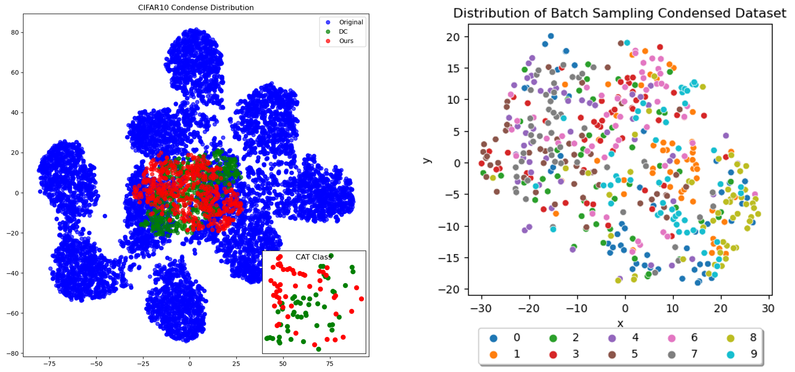

# Dataset Condensation using Batch Sampling
## Introduction

데이터셋 응축은 거대한 학습 데이터셋을 작은 데이터셋으로 응축해 모델 학습의 부담을 줄이고자 제안되었고, 분포를 학습하는 데이터셋 응축 연구는 그래디언트를 이용한 데이터셋 응축보다 높은 성능을 보여준다. 

그래디언트를 이용한 데이터셋 응축은 모델과 응축 데이터셋을 동시에 학습해야 하는 Bi-Optimization 문제이다. 한편 분포를 학습하는 데이터셋 응축은 응축 데이터셋만 학습하면 되기 때문에 그래디언트를 이용한 데이터셋 응축보다 학습 시간이 빠르고 최적해를 찾기 쉽다.

이런 한계를 극복하기 위해 본 연구에서는 입력 샘플의 특징을 기반으로 학습 배치를 구성하여 기존 방법보다 강하고 일관된 그래디언트를 발생시켜 학습을 돕고자 한다. ResNet18로부터 추출한 특징에 대해 K-Means 클러스터링을 수행하고 이를 바탕으로 배치를 구성한다.

그러나 실험을 통해 제안하는 방법이 기존 그래디언트를 이용한 데이터셋 응축 방법보다 열등한 성능을 보여주고 응축 데이터셋의 분포에 도움을 주지 못하는 것을 확인했다. 그러나 Matching Loss는 현저하게 큼에도 불구하고 유사한 정확도를 보여주는 결과를 보여 Matching Loss의 동작과 역할에 대한 추가적인 연구가 필요하다.


## Related Works
### 그래디언트를 이용한 데이터셋 응축 방법
- Dataset Condensation with Gradient Matching(DC) [[PDF]](https://openreview.net/pdf?id=mSAKhLYLSsl) [[Code]](https://github.com/VICO-UoE/DatasetCondensation)
  - 원본 데이터셋과 유사한 그래디언트를 생성하도록 응축 데이터셋을 합성
  - 모델과 응축 데이터셋을 동시에 학습시키며 원본 데이터의 그래디언트 변화 과정을 따라가도록 학습
- Dataset Condensation with Differentiable Siamese Augmentation [[PDF]](http://proceedings.mlr.press/v139/zhao21a/zhao21a.pdf) [[Code]](https://github.com/VICO-UoE/DatasetCondensation)
  - 원본 데이터셋과 응축 데이터셋에 같은 미분 가능한 데이터셋 증강 방법을 적용해 DC의 정확도를 크게 향상
- Delving into Effective Gradient Matching for Dataset Condensation [[PDF]](https://arxiv.org/abs/2208.00311)
  - Gradient Matching Loss의 intra-class loss에서 inter-class loss로 확장

### 분포 학습을 이용한 데이터셋 응축 방법
- Dataset Condensation with Distribution Matching(DM) [[PDF]](https://arxiv.org/pdf/2110.04181.pdf) [[Code]](https://github.com/VICO-UoE/DatasetCondensation)
  - 원본 데이터셋의 분포를 학습해 응축 데이터셋을 합성
  - DC와 성능은 유사하지만 계산량이 크게 줄어 ImageNet까지 확대할 수 있었음
- CAFE: Learning to Condense Dataset by Aligning Features [[PDF]](https://arxiv.org/pdf/2203.01531.pdf) [[Code]](https://github.com/kaiwang960112/cafe)
  - 모델이 원본 이미지로부터 학습한 Feature를 학습하여 응축 데이터셋을 합성
  - Discriminator Loss를 사용하여 최대한 다양한 응축 샘플을 합성하도록 학습


## Proposed Method

<p align="center"></p>
<center> 그림 1. Batch Sampling을 이용한 데이터셋 응축 방법. 각 클래스 샘플들을 Pretrained ResNet18을 이용해 특징맵을 추출하고, 특징맵을 사용하여 클러스터링을 수행한다. 각 클래스 내의 임의의 클러스터로부터 샘플을 선택해 배치를 구성한다. 유사한 특징을 가진 배치를 사용해 데이터셋 응축을 수행함으로써 각 특징에 대한 강한 그래디언트를 발생시켜 데이터셋 응축을 돕는다.
</center><br>

## Setup
필요한 패키지 설치
```
python -m pip install -r requirements.txt
```
    parser.add_argument('--method', type=str, default='DC', help='DC/DSA/BS')
    parser.add_argument('--dataset', type=str, default='CIFAR10', help='dataset')
    parser.add_argument('--model', type=str, default='ConvNet', help='model')
    parser.add_argument('--ipc', type=int, default=1, help='image(s) per class')
    parser.add_argument('--eval_mode', type=str, default='S', help='eval_mode') # S: the same to training model, M: multi architectures,  W: net width, D: net depth, A: activation function, P: pooling layer, N: normalization layer,
    parser.add_argument('--num_exp', type=int, default=5, help='the number of experiments')
    parser.add_argument('--num_eval', type=int, default=20, help='the number of evaluating randomly initialized models')
    parser.add_argument('--epoch_eval_train', type=int, default=300, help='epochs to train a model with synthetic data')
    parser.add_argument('--Iteration', type=int, default=1000, help='training iterations')
    parser.add_argument('--lr_img', type=float, default=0.1, help='learning rate for updating synthetic images')
    parser.add_argument('--lr_net', type=float, default=0.01, help='learning rate for updating network parameters')
    parser.add_argument('--batch_real', type=int, default=256, help='batch size for real data')
    parser.add_argument('--batch_train', type=int, default=256, help='batch size for training networks')
    parser.add_argument('--init', type=str, default='noise', help='noise/real: initialize synthetic images from random noise or randomly sampled real images.')
    parser.add_argument('--dsa_strategy', type=str, default='None', help='differentiable Siamese augmentation strategy')
    parser.add_argument('--dis_metric', type=str, default='ours', help='distance metric')
    parser.add_argument('--data_path', type=str, default='data', help='dataset path')
    parser.add_argument('--save_path', type=str, default='results', help='path to save results')
    parser.add_argument('--cluster_path', type=str, default='clustering', help='path to save results')
    parser.add_argument('--layer_idx', type=int, default=1, help='layer of subclass')
    parser.add_argument('--num_cluster', type=int, default=20)
    parser.add_argument('--norm', action='store_true', default=True)

## Experiments
###  기본 실험 - 표 1
```
python main.py  --dataset CIFAR10  --model ConvNet --method BS --ipc 10 --layer_idx 3 --num_cluster 20 --norm
# --method : DC, DSA, BS
# --ipc (images/class): 1, 10, 20, 30, 40, 50
# --layer_idx : 0,1,2,3
# --num_cluster : 5, 10, 15, 20, 25
# --norm : distribute similar size of cluster
```


## Performance
|  | DC | DSA | Ours |
 :-: | :-: | :-: | :-: |
| 1 img/cls  | 28.3 $\pm$ 0.5 | 28.8 $\pm$ 0.7 | 28.1 $\pm$ 0.6 |
| 10 img/cls | 44.9 $\pm$ 0.5 | 52.1 $\pm$ 0.5 | 42.8 $\pm$ 0.6 |
| 50 img/cls | 53.9 $\pm$ 0.5 | 60.6 $\pm$ 0.5 | 52.9 $\pm$ 0.7 |

표 1. 기존 방법들과의 데이터셋 응축 성능 비교. CIFAR10 데이터셋, ConvNet, Layer 3으로부터 추출한 특징을 20개의 클러스터로 구성하여 Batch Sampling을 수행했다.
<p align="center"></p>
<center>그림 2. (좌) Batch Sampling으로 응축한 데이터셋. (우) 기존 방법들과의 Matching Loss 변화. 기존 방법들보다 Loss가 커진 것을 확인할 수 있다. 원본 이미지에 대한 그래디언트는 커졌지만 합성 이미지에 대한 그래디언트는 여전히 작아 Loss가 커졌다. </center><br>

<p align="center"></p>
<center>그림 3. 기존 방법들과의 Gradient L2 Norm 비교. 원본 이미지에 대해 기존 방법보다 큰 그래디언트를 발생시키는 것을 볼 수 있지만 합성 이미지에서는 기존 방법보다 작은 그래디언트가 발생한다. 성능이 제일 좋은 DSA는 합성 이미지와 실제 이미지의 그래디언트 차이가 크지 않은 것을 확인할 수 있다. </center><br>

<p align="center"></p>
<center>그림 4. CIFAR10 데이터셋의 tSNE 시각화. 원본 데이터셋(파란색)과 DC로 응축한 데이터셋(초록색), 그리고 Batch Sampling을 이용한 응축 데이터셋(빨간색)이다. Batch Sampling은 DC와 유사한 데이터 공간에 분포되어 있으며 응축 샘플들이 특징을 충분히 학습하지 못한 것을 확인할 수 있다. </center><br>

## Ablation Study Results
**클러스터 개수에 따른 성능 비교**
| | 5 | 10 | 15 | 20 | 25 | DC |
 :-: | :-: | :-: | :-: | :-: | :-: | :-: |
| 1 img/cls  | 28.0 $\pm$ 0.6 | 27.6 $\pm$ 0.5 | 28.1 $\pm$ 0.6 | 28.1 $\pm$ 0.6 | **28.6 $\pm$ 0.7** | **28.3 $\pm$ 0.5** |
| 10 img/cls | 42.6 $\pm$ 0.7 | 43.1 $\pm$ 0.4 | 43.1 $\pm$ 0.6 | 42.8 $\pm$ 0.6 | 42.8 $\pm$ 0.4 | **44.9 $\pm$ 0.5** |
| 50 img/cls | **53.5 $\pm$ 0.5** | 53.3 $\pm$ 0.6 | 52.7 $\pm$ 0.5 | 52.9 $\pm$ 0.7 | 53.3 $\pm$ 0.6 | **53.9 $\pm$ 0.5** |

**특징 추출 레이어에 따른 성능 비교**
|  | Layer 0 | Layer 1 | Layer 2 | Layer 3 | DC |
 :-: | :-: | :-: | :-: | :-: | :-: |
| 1 img/cls  | 27.8 $\pm$ 0.6 | **28.3 $\pm$ 0.5** | 28.0 $\pm$ 0.5 | 28.1 $\pm$ 0.6 | **28.3 $\pm$ 0.5** |
| 10 img/cls | **43.6 $\pm$ 0.6** | 42.7 $\pm$ 0.6 | 43.0 $\pm$ 0.5 | 42.8 $\pm$ 0.6 | **44.9 $\pm$ 0.5** |
| 50 img/cls | 52.0 $\pm$ 0.7 | 52.8 $\pm$ 0.4 | 52.6 $\pm$ 0.5 | **52.9 $\pm$ 0.7** | **53.9 $\pm$ 0.5** |


<p align="center"></p>
<center>그림 5. 특징 추출 레이어에 따른 성능 비교에서 10img/cls에서는 Layer 0이 가장 좋은 결과를 보였고 50img/cls에서는 Layer 3이 가장 좋은 결과를 보였다. 그래프에서 확인할 수 있듯이 이는 특정 레이어에 영향이 있는 것이 아니라 합성 이미지에서 더 큰 그래디언트를 발생시킨 경우에 더 좋은 성능을 보이는 것으로 확인된다. </center><br>


## Conclusion
- 원본 데이터셋에 대해 더 큰 그래디언트가 발생하지만 합성 샘플의 그래디언트로의 영향이 적다.
- 원본 데이터셋의 그래디언트가 커지면서 Matching Loss 또한 함께 증가하지만 응축 성능은 유사하다.
- 기존 방법과 유사한 데이터 분포를 보이고 확장된 영역을 탐색하는데 어려움을 겪는다.

Batch Sampling을 통한 성능 향상은 나타나지 않았다. 그래디언트를 보존하는 것과 다양한 데이터를 학습하는 것이 정확도 향상에 도움이 된다. 또한 배치 구성만으로 원본 데이터셋의 분포를 충분히 학습할 수 없었기 때문에 원본 데이터셋의 분포를 학습하는 Generative Adversarial Networks(GANs) 방식이 도움이 될 수 있다.

### Author
- Donghoon Kim [[Email]](dhkim2810@khu.ac.kr) , Sungho Bae [[Google Scholar]](https://scholar.google.co.kr/citations?user=EULut5oAAAAJ)

